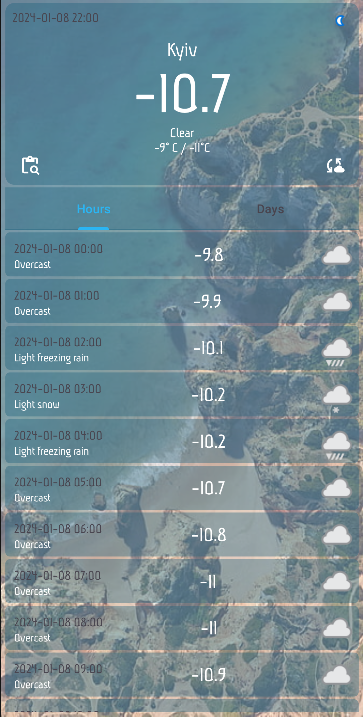

# Weather forecast
 The application is written based on the database from the site "Weatherapi" `https://www.weatherapi.com/`.

## Quick start
To use the application you need to register on the site above and get your Api Key and paste it into a constant in file "MainFragment.kt"

```Kotlin
const val API_KEY = "Your_Api_Key"
```


The application works both by geolocation of the user and by searching for a locality

The ability to view the weather for a given time, by the hour, and three days in advance ( "Weather Api" Allows you to receive weather data for a maximum of three days in advance on a free account)




